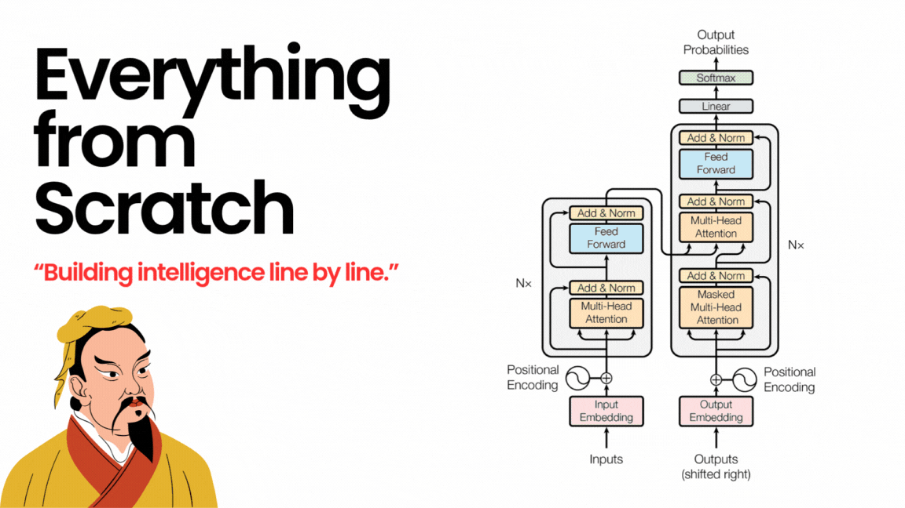

## Index

### Machine Learning Models
| Implementation | Code | Extra Notes |
|----------------|-----------|-------------|
| Linear Regression | [LinearRegression.py](ml-models/LinearRegression.py) | |
| Logistic Regression (Binary Classification) | [LogisticRegression.py](ml-models/LogisticRegression.py) | |
| Multinomial Log Regression (Multiclass Classification) | [MultinomialLogisticRegression.py](ml-models/MultinomialLogisticRegression.py) | |
| K-Nearest Neighbors (KNN) | [KNN.ipynb](ml-models/KNN.ipynb) | |
| K-Means Clustering | [KMeans.ipynb](ml-models/KMeans.ipynb) | |

### Neural Networks
| Implementation | Code | Extra Notes |
|----------------|-----------|-------------|
| MLP (Neural Network from Scratch) | [MLP.py](ml-models/MLP.py) | [backprop](assets/MLP.md) |
| LSTM | [LSTM.py](LSTM/LSTM.py) | [Notes](LSTM/README.md) |

### Attention Mechanisms
| Implementation | Code | Extra Notes |
|----------------|-----------|-------------|
| Self Attention | [SelfAttention.py](Attention/SelfAttention.py) | |
| Multi-Head Attention | [MultiHeadAttention.py](Attention/MultiHeadAttention.py) | |
| Naive Multi-Head Attention | [NaiveMultiHeadAttention.py](Attention/NaiveMultiHeadAttention.py) | |
| Multi-Query Attention | [MultiQueryAttention.py](Attention/MultiQueryAttention.py) | |
| Grouped-Query Attention | [GroupedQueryAttention.py](Attention/GroupedQueryAttention.py) | |

### Normalization Techniques
| Implementation | Code | Extra Notes |
|----------------|-----------|-------------|
| Batch Normalization | [BatchNorm.py](Normalization/BatchNorm.py) | |
| Layer Normalization | [LayerNorm.py](Normalization/LayerNorm.py) | |
| RMS Normalization | [RMSNorm.py](Normalization/RMSNorm.py) | |

### Language Models
| Implementation | Code | Extra Notes |
|----------------|-----------|-------------|
| GPT-2 Implementation | [main.py](GPT2/main.py) |  |
| Llama 2 Implementation | [main.py](llama2/main.py) |  |
| Llama 3 Implementation | [main.py](llama3/main.py) |  |
| Llama 3.1 Implementation | [main.py](llama3.1/main.py) | |

<!-- ### Utilities
| Implementation | Code | Extra Notes |
|----------------|-----------|-------------|
| Activation Functions | [activations.py](utils/activations.py) | |
| Loss Functions | [loss_functions.py](utils/loss_functions.py) | |
| General Utilities | [utils.py](utils/utils.py) | | -->

> More implementations coming soon... 
> - [ ] Qwen
> - [ ] KV Cache
> - [ ] Knowledge Distillation
    